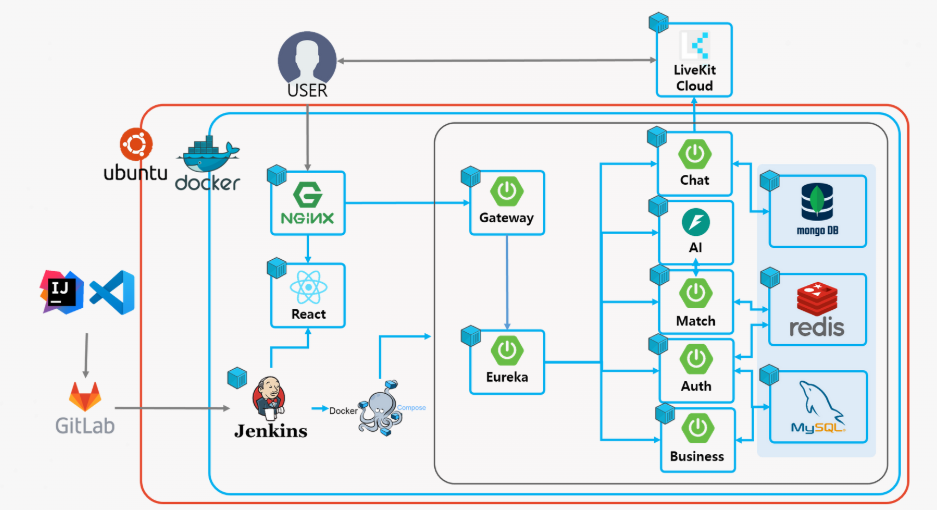

# 은하수다

---

## 목차

## 프로젝트 소개

우주 테마의 AI 기반 고민 유사도 점수를 활용한 1:1 매칭 화상 채팅 서비스

> 외로운 별들을 위한 빛나는 만남,
익명의 마음들이 전하는 따스한 위로,
고민 속에서 서로를 발견하며 함께 힐링해요
> 

## 기술 스택

### FE

- react, vite, axios
- eslint, prettier
- react three fiber / drei
- livekit
- capacitor
- stompjs sockjs-client
- tanstack query / zustand
- shadcn-ui / tailwindcss / motion
- msw

### BE

- Spring boot, Java
- Spring Cloud Gateway
- Spring Security
- Eureka
- Stomp, SockJS
- MySQL, MongoDB, Redis

### Infra

- Nginx
- Jenkins
- Docker
- Docker-compose

## 주요 기능

### FE

- 3D
- WebRTC
- socket (stompjs, sockjs)
- 상태 관리

### BE

- **webrtc**
- **Gateway & Eureka**
    - **Gateway를 통한 모든 모듈 통합 운영**
        
        모든 서비스 모듈은 Gateway를 통해 작동하며, Gateway에서 JWT 토큰 검증 필터를 적용하여 인증을 처리합니다. 이를 통해 각 서비스의 인증 부담을 줄이고 성능을 최적화하였습니다.
        
    - **Eureka 기반 Service Discovery 활용**
        
        Eureka를 이용해 서비스 자동 등록 및 해제를 관리하며, Gateway와 연동하여 최신 서비스 목록을 반영할 수 있도록 구성하였습니다. 이를 통해 유동적인 배포가 가능하도록 지원하였습니다.
        
    - **FeignClient를 활용한 모듈 간 REST API 호출**
        
        FeignClient를 사용하여 서비스 간 REST API 호출을 수행하며, Eureka와 연동하여 동적으로 서비스 위치를 확인하고 호출하도록 구현하였습니다.
        
    - **Spring Security 필터 체인을 활용한 보안 정책 적용**
        
        Spring Security의 필터 체인을 활용하여 권한 부여 및 보안 정책을 적용하였으며, 인증 및 인가 절차를 체계적으로 구성하였습니다.
        
- OAUTH
    - **JWT Token을 사용한 로그인**
        
        로그인 시 RefreshToken을 저장하기 위해서 사용하였으며 보안성을 강화하기 위해서 엑세스 토큰 갱신시에 리프레시 토큰도 같이 갱신되는 `Refresh Token Rotation` 방식을 채용하였습니다.
        
- **Database**
- **Matching**
    - **상태 관리 및 데이터 저장:**
        - **Redis:**
            - 사용자 상태(UserMatchStatus) 저장
            - 대기 큐(Waiting Pool)를 Sorted Set으로 관리
            - 매칭 정보 저장 및 조회
            - 원자적 상태 전환을 위한 Lua 스크립트 사용
    - **실시간 통신:**
        - **WebSocket (STOMP + SockJS):**
            - 사용자에게 실시간 매칭 알림 및 채팅방 정보 전송
            - 브로드캐스트를 통해 대기 유저 입/퇴장 알림 제공
    - **비동기 및 지연 실행:**
        - **CompletableFuture.delayedExecutor:** 매칭 알림 지연(3초) 및 매칭 취소 예약(1분) 처리

### INFRA

1. **MSA 기반 독립 서비스 구조**
    - **독립적 확장성**: 각 API 서비스(인증, 매칭, 채팅 등)가 별도의 컨테이너로 배포되어 특정 서비스에 부하가 집중되더라도 해당 서비스만 확장 가능
    - **장애 격리 및 유지보수 용이성**: 서비스 간 의존성이 낮아 하나의 서비스 장애가 전체 시스템에 영향을 주지 않음
2. **컨테이너화 및 자동화된 CI/CD**
    - **Docker & docker-compose**: 전체 백엔드와 프론트엔드가 컨테이너로 운영되어 일관된 배포 환경 제공
    - **Jenkins 파이프라인**: 병렬 빌드와 자동 배포를 통해 빠른 개발 주기와 안정적 운영 지원
3. **Nginx 리버스 프록시 및 보안 강화**
    - **SSL/TLS 인증 및 HTTP → HTTPS 리다이렉트**: 보안 강화와 최신 프로토콜 사용
    - **세밀한 프록시 설정**: WebSocket 지원(STOMP/SockJS)과 동적 CORS 설정으로 다양한 클라이언트 환경 대응
    - 외부에서 직접 서버에 접근하지 못하도록 설정
4. **통합 서비스 관리와 건강 상태 모니터링**
    - **Eureka 및 API Gateway**: 서비스 디스커버리와 중앙 집중식 요청 라우팅으로 효율적인 트래픽 관리
    - **헬스체크 및 의존성 관리**: 각 컨테이너에 헬스체크를 설정하여 안정적 운영 보장

## 구조 및 아키텍쳐

- 마이크로서비스 아키텍처(MSA) 기반 설계
- Ubuntu 서버에서 Docker 기반으로 애플리케이션 실행
    - **Docker & Docker Compose**
        - 각 마이크로서비스는 Docker 컨테이너로 배포됩니다.
        - Docker Compose를 통해 여러 컨테이너를 효율적으로 관리합니다.
- Certbot을 통해  SSL/TLS 인증서 발급 받아서 보안 강화
- Reverse Proxy

## 매칭 로직

1. **매칭 시작**
    - **클라이언트 요청 → MatchController.startMatching**사용자가 고민, 선호 MBTI 등 매칭 요청 정보를 전송하면, 서버는 이를 바탕으로 UserMatchStatus 객체를 생성합니다.
    - **MatchController → MatchService.startMatching**외부 API로부터 추가 사용자 정보(예: MBTI, 에너지)를 조회한 후, 사용자의 상태를 WAITING으로 설정하여 Redis에 저장하고 대기 큐에 등록합니다. 동시에 WebSocket을 통해 “매칭 대기 시작” 알림을 전송합니다.
2. **매칭 후보 선정 및 매칭 생성**
    - **MatchService.processMatchingQueue (스케줄러)**주기적으로(5초마다) 대기 큐에서 WAITING 상태인 사용자들을 모아 strict(선호 MBTI 완벽 일치)와 relaxed(부분 MBTI 유사도) 조건에 따라 후보 쌍을 평가 및 정렬합니다.
    - **원자적 상태 전환**평가된 후보 쌍에 대해 두 사용자의 상태를 Lua 스크립트를 사용해 WAITING에서 IN_PROGRESS로 원자적으로 전환합니다.
    - **MatchProcessor.createMatch**매칭 ID를 생성하고 두 사용자의 상태를 MATCHED로 업데이트한 후, Redis에 매칭 정보를 저장합니다. 이어서 3초 지연 후 WebSocket 알림을 전송하며, 1분 내 응답이 없으면 자동 취소 예약을 진행합니다.
3. **매칭 응답 처리**
    - **클라이언트 응답 → MatchController.handleMatchResponse**사용자들이 매칭 알림에 대해 수락 또는 거절 응답을 보내면, 이를 전달받아 처리합니다.
    - **MatchService.processMatchApproval**사용자 응답에 따라 분기 처리되며, 양측 모두 수락하면 채팅방 생성으로 연결되고, 거절 시에는 해당 매칭을 취소하고 상태를 초기화하며 거절 기록을 남깁니다.
4. **채팅방 생성**
    - **MatchProcessor.createChat**최종적으로 두 사용자가 모두 수락하면, 외부 API 호출을 통해 채팅방을 생성하고, 채팅방 정보(채팅방 ID, 세션, 토큰 등)를 각 사용자에게 WebSocket으로 전송합니다. 사용자 상태는 “Chatting”으로 업데이트되어 실제 채팅이 시작됩니다.

## 팀원&역할

| 이름 | 역할 | 개발 내용 |
| --- | --- | --- |
| 민인애 | FE |  |
| 박유진 | FE |  |
| 김준형 | INFRA |  |
| 박도아 | BE |  |
| 차수홍 | BE |  |
| 홍찬우 | BE |  |
